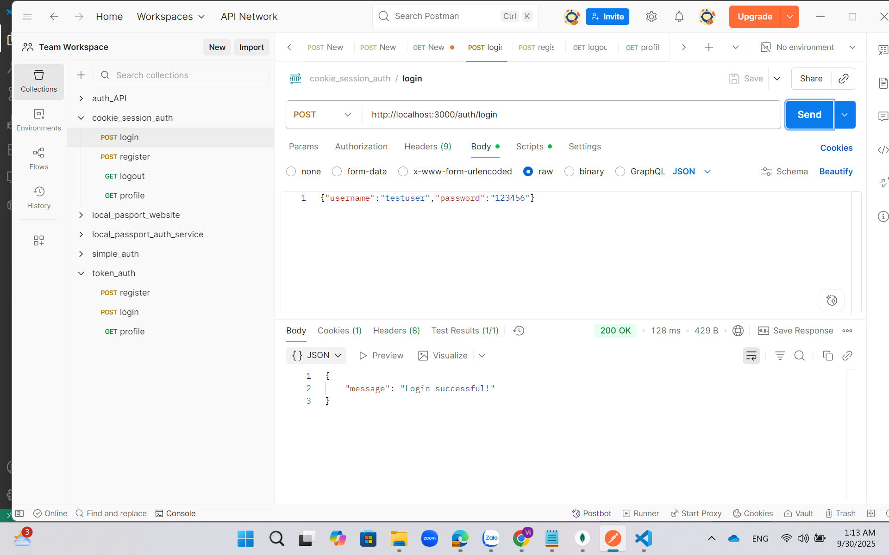

# Cookie Session Auth

Dự án này là một dịch vụ xác thực dựa trên cookie session được thiết kế để xử lý các quy trình xác thực người dùng. Nó bao gồm các mô-đun và cấu hình khác nhau để quản lý chức năng đăng nhập, đăng xuất, quản lý hồ sơ và đăng ký. Cấu trúc dự án có thư mục `public/results` chứa các tài nguyên hình ảnh cho giao diện xác thực.

## Cấu trúc Dự án
- `cookie_session_auth/`: Thư mục chứa mã nguồn dịch vụ xác thực.
- `models/`: Các mô hình dữ liệu được sử dụng trong quá trình xác thực.
- `node_modules/`: Các phụ thuộc của Node.js.
- `public/results/`: Thư mục chứa các hình ảnh kết quả.
  - `cookie_in_db.png`: Hình ảnh đại diện cho cookie được lưu trong cơ sở dữ liệu.
  - `cookie_logout_db.png`: Hình ảnh đại diện cho cookie khi đăng xuất từ cơ sở dữ liệu.
  - `login.png`: Hình ảnh đại diện cho giao diện đăng nhập.
  - `logout.png`: Hình ảnh đại diện cho giao diện đăng xuất.
  - `profile.png`: Hình ảnh đại diện cho giao diện hồ sơ người dùng.
  - `register.png`: Hình ảnh đại diện cho giao diện đăng ký.
  - `user_in_db.png`: Hình ảnh đại diện cho người dùng được lưu trong cơ sở dữ liệu.
- `routes/`: Định nghĩa các tuyến đường cho ứng dụng.
- `.gitignore`: Tệp git ignore để loại bỏ các tệp không cần thiết.
- `app.js`: Tệp chính của ứng dụng.
- `package-lock.json`: Tệp khóa cho các phụ thuộc gói.
- `package.json`: Thông tin dự án và các phụ thuộc.

## Hình ảnh
Dưới đây là các hình ảnh được lưu trong thư mục `public/results`:





## Dữ liệu Test JSON
Dưới đây là dữ liệu test JSON để sử dụng trong dự án:

```json
{
  "username": "testuser",
  "password": "12345"
}
```

## Cách sử dụng
Để sử dụng dự án này, hãy đảm bảo tất cả các phụ thuộc đã được cài đặt bằng cách chạy `npm install`. Cấu hình cài đặt xác thực trong thư mục `config`, và khởi động ứng dụng với lệnh `node app.js`. Sử dụng dữ liệu test JSON ở trên để kiểm tra chức năng đăng nhập.